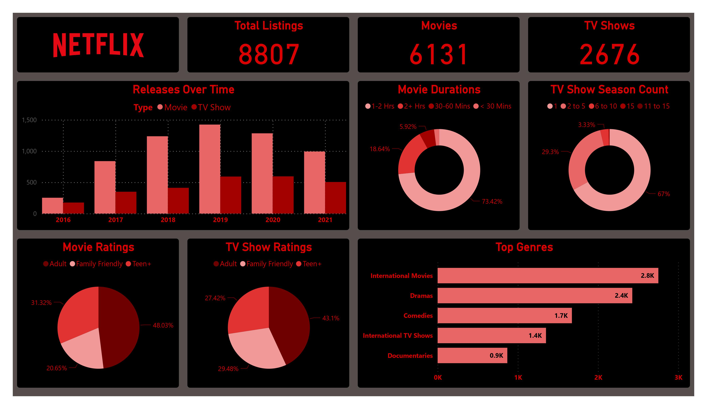
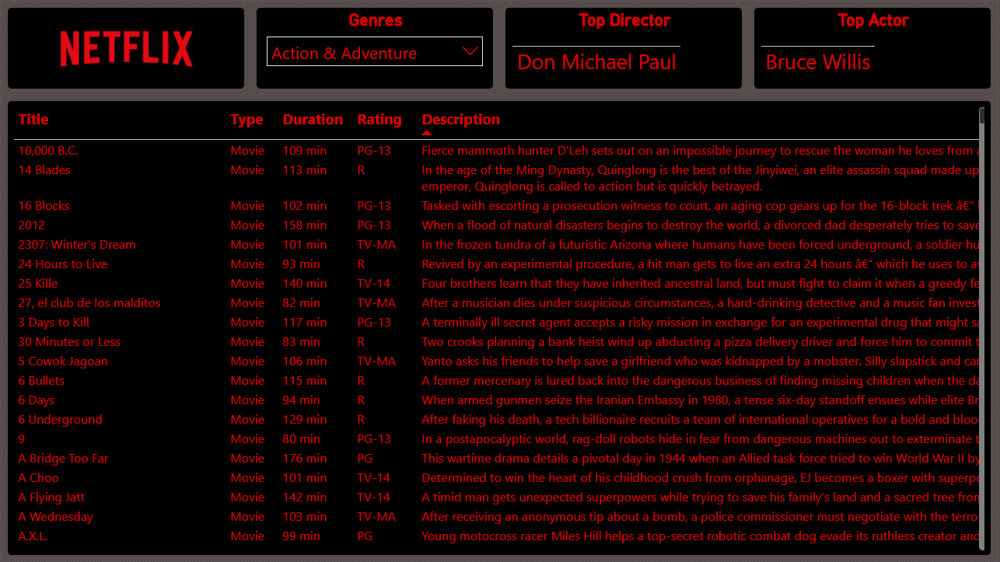

# Netflix-Analysis
Netflix Titles Data Analysis &amp; Visualization in PowerBI. Dataset from Kaggle

## Project Description
Creating Visualizations for a Netflix Dataset

## Project Roadmap
- Collect Dataset from [Kaggle](https://www.kaggle.com/datasets/shivamb/netflix-shows)
- Import Data
- Data Cleaning & Transforming
- Create New Tables for Cast, Countries, Directors, and Genres
- Establish Bi-Directional Relationships between Tables
- Additional Columns for Durations and Ratings Groupings
- Create Visualizations
- Establish Report Theme
- Finalize and Launch Report
## Data Visualizations

#### Page 1: Summary
- Card: Total Listing #
- Card: Total Movie #
- Card: Total TV Show #
- Clustered Column Chart: Releases Over Time (Year) by Movie & TV Show
- Donut Chart: Movie Durations
- Donut Chart: TV Show Durations
- Pie Chart: Movie Ratings (Custom Groupings)
- Pie Chart: TV Show Ratings (Custom Groupings)
- Stacked Bar Chart: Top 5 Genres by Count

#### Page 2: Genre Details
- Slicer: Genres
- Matrix: Top Director (By Show Count)
- Matrix: Top Actor (By Show Count)
- Matrix: Movie List
- Notes: Changing genres in the slicer will update the director, actor, and show list. Selecting the director or actor's name will allow for additional filtering based on that individual.

